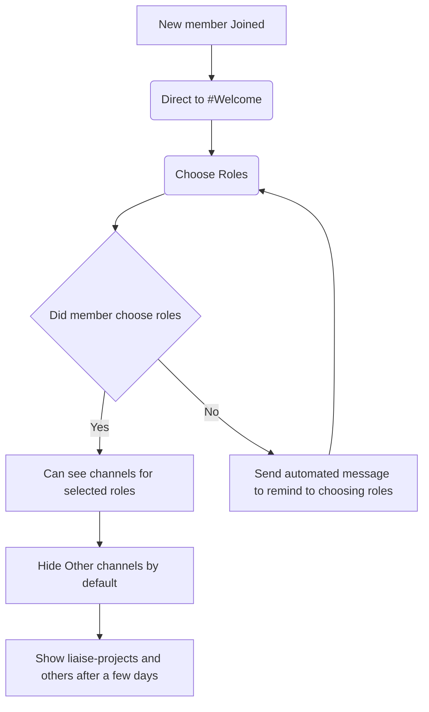

# Policy

## New member workflow

## Submit New Idea/Project 
- For initial team building only
- Better template with a very specific ask and then lock it
- Close the post once the ask is addressed
- Need status tags for each collaborative
- Limit the time (24 hours) to reply back to the interested volunteer.
  
  **Ticketing**: A new project or a request that we don't know anything about before
     - Submit a form and hold it in a dedicated channel
     - Assign a PM (if needed) to this project and meet with the requester. 
     - Send a post in the collaborator-matching

## Collaborator Matching

**Bot Command**:An existing project
