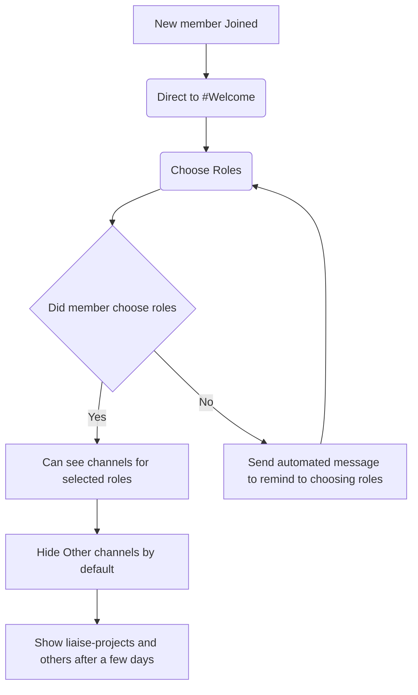
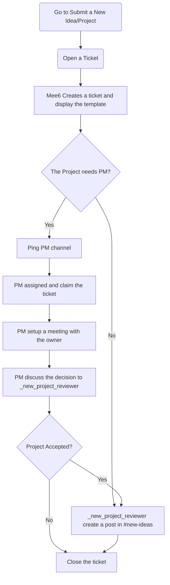

# Policy

## New member workflow

## New Idea/Project 

### Submit the idea/project

> Note: A better template with specific details is required.

### Onboard the new idea/project
- Close the post once the ask is addressed
- Need status tags for each collaborative
- Limit the time (24 hours) to reply back to the interested volunteer.

## Collaborator Matching

**Bot Command**:An existing project
