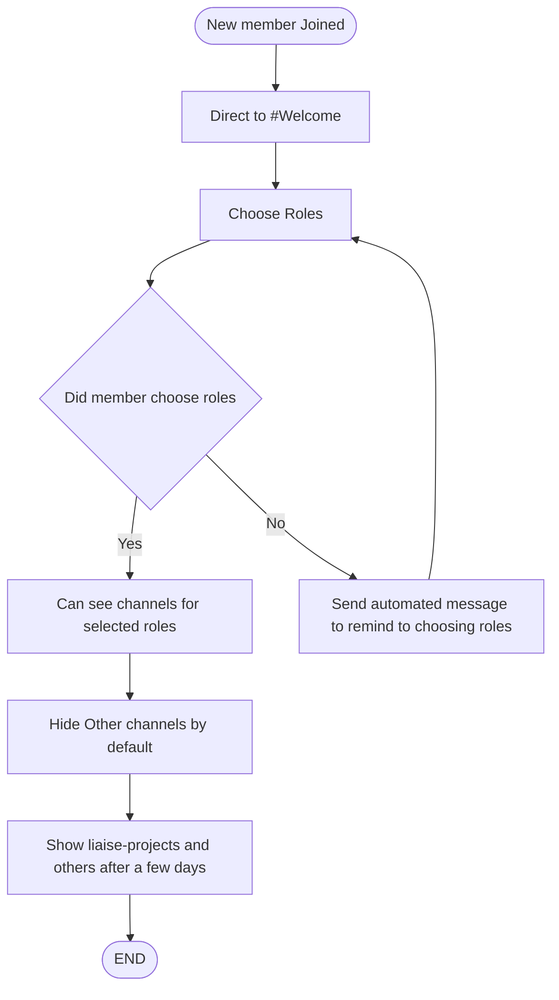
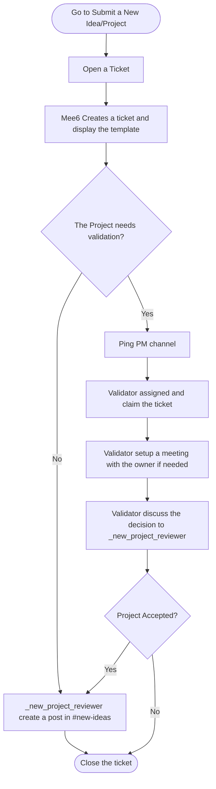
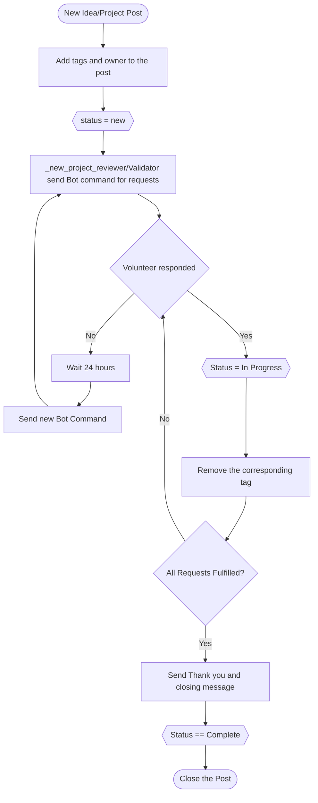
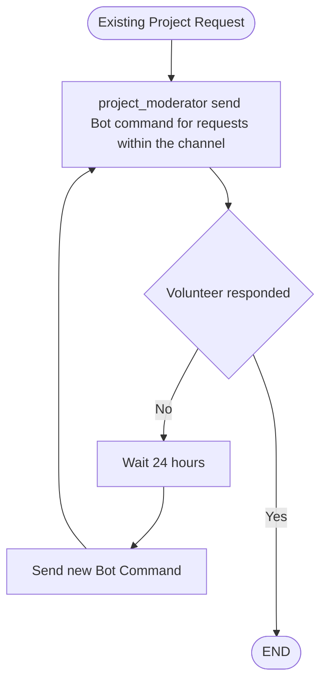

# Policy

## New member workflow

## New Idea/Project workflow
This workflow addresses the following scenarios:
1. A project that is neither TFP nor a liaise project. (Whether it's interested to be a TFP liaise or not)
2. A new idea that pro-Palestine wants to discuss.

### Submit the idea/project

> Note: A better template with specific details is required.

### Onboard the new idea/project

## Collaborator Matching
An existing project workflow to request volunteering help by using **Bot Command** within their channel

